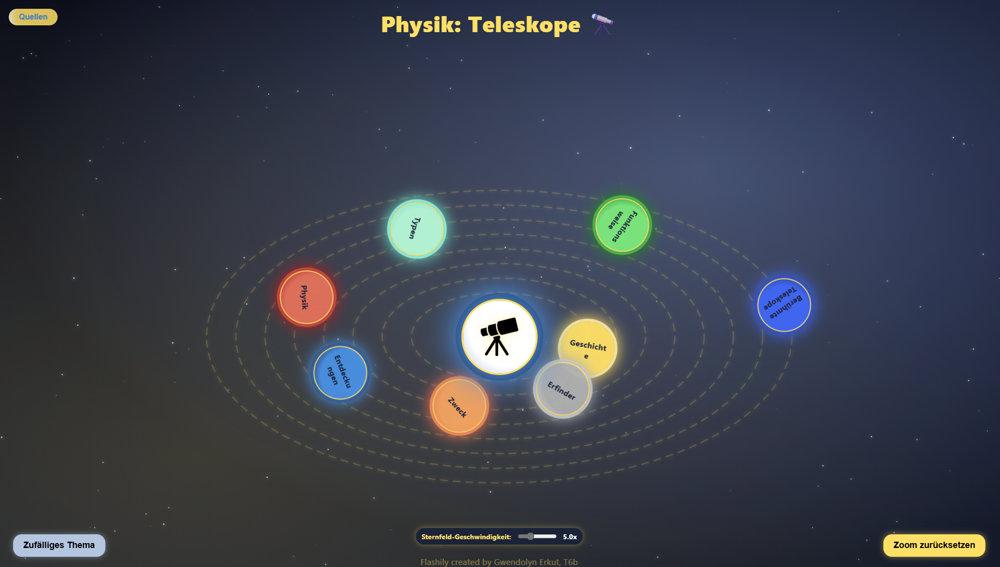

# Interactive Telescope Infographic

A modern, interactive infographic website about telescopes, featuring animated star backgrounds, clickable topics, and engaging modal content.

---

## Flashily created by Gwendolyn Erkut, T6b

---

## Features

- Animated starfield background
- Interactive, animated topic orbs with SVG icons
- Central telescope icon (double-click for a fun mini-game!)
- Smooth modal windows with facts, images, and SVG art
- Responsive and visually appealing design

## Usage

Open `index.html` in your browser.

## Structure

- `index.html` — Main HTML file
- `style.css` — Styles and animations
- `script.js` — Interactivity and starfield
- `assets/` — Images and SVGs

## Preview

## License

MIT
